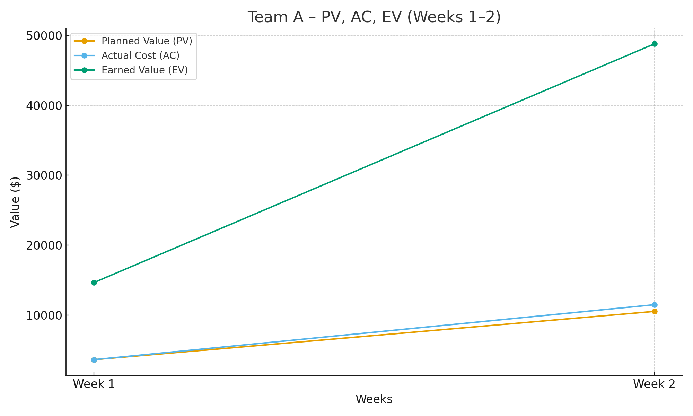
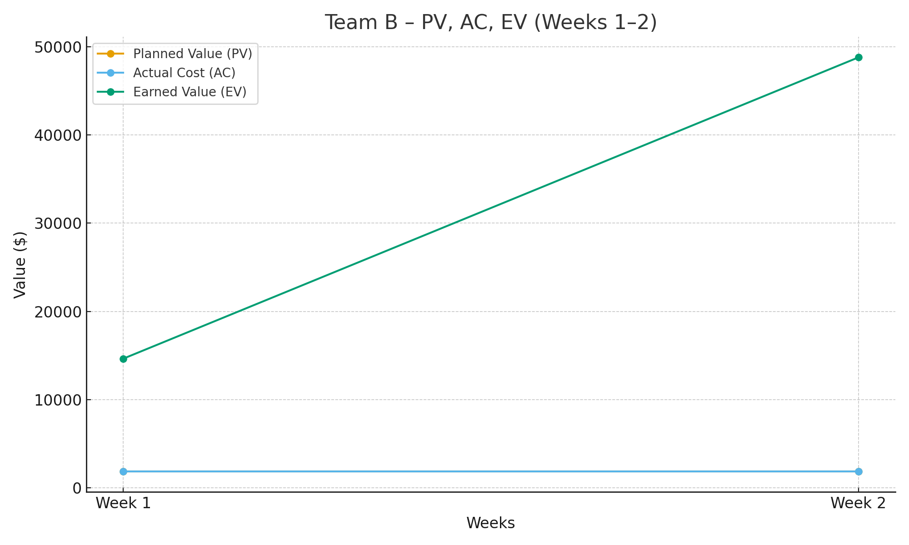
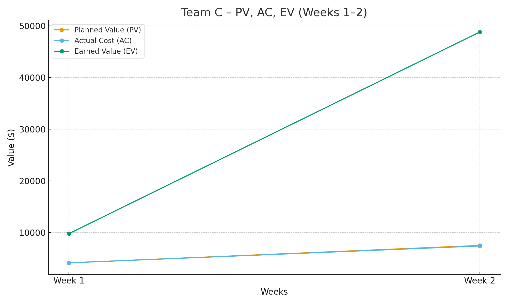
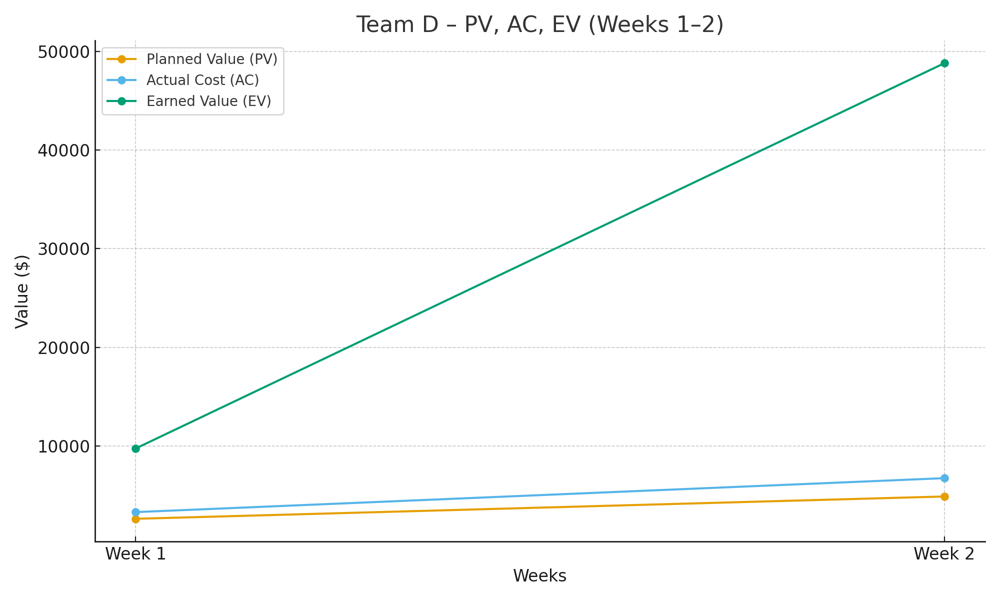
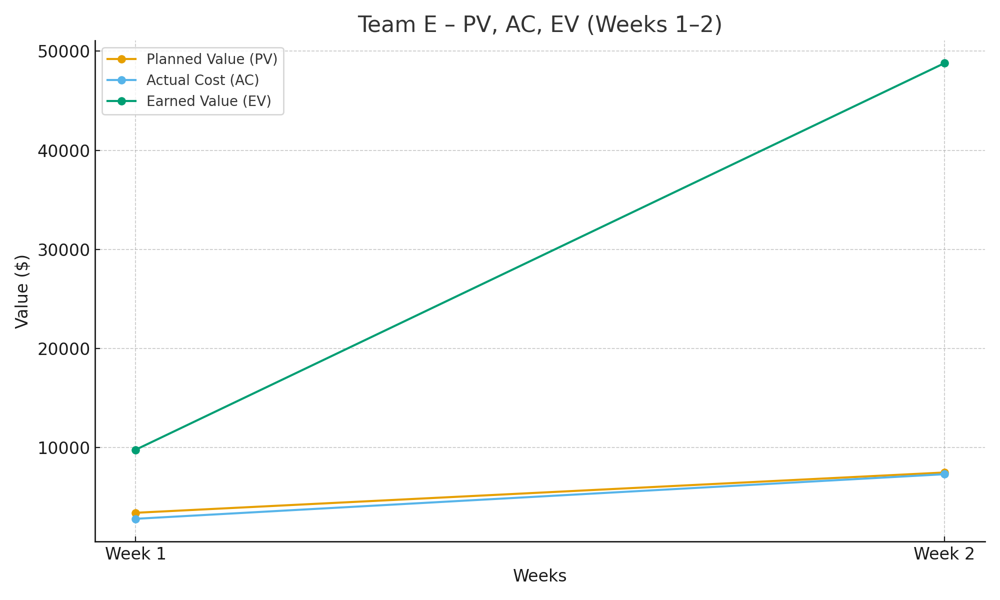

# Overall Summary – Weeks 1 & 2

## Overall Trends
- **Milestone 1 (Project Plan and SRS) was completed on schedule Aug 30th, 2025.**
- **Cost and schedule health** (CPI & SPI) are all **green** (>1.0) for every team in both weeks.
- Incremental performance in Week 2 shows progress building as teams move toward future milestones.

## Team Highlights
| Team   | Week 1 CPI / SPI | Week 2 CPI / SPI | Cost Health | Schedule Health |
|--------|------------------|------------------|-------------|-----------------|
| **Team A** | 4.06 / 4.06 | 4.25 / 4.64 | Green | Green |
| **Team B** | ~3.7 / ~3.8 | ~4.1 / ~4.3 | Green | Green |
| **Team C** | ~2.6 / ~2.7 | ~3.1 / ~3.3 | Green | Green |
| **Team D** | ~2.2 / ~2.4 | ~2.9 / ~3.0 | Green | Green |
| **Team E** | ~3.0 / ~2.8 | ~3.5 / ~3.1 | Green | Green |

## Key Insights
- **Strong Start:** All teams are meeting schedule expectations while maintaining cost efficiency.
- **On-Time Delivery:** The jump in Earned Value (EV) in Week 2 reflects the planned completion of Milestone 1, not early work.
- **Variance Monitoring:** Positive cost and schedule variances are strong indicators now, but should be tracked closely as more complex milestones progress.

---

# Team A – Week 1 & 2 Performance

### Team A – Week 1 & Week 2 Performance

**Week 1 (Cumulative):**
- Planned Value (PV): $3,604
- Actual Cost (AC): $3,604
- Earned Value (EV): $14,640
- Cost Variance (CV): $11,036
- Schedule Variance (SV): $11,036
- CPI: 4.06
- SPI: 4.06

**Week 2 (Cumulative):**
- Planned Value (PV): $10,515
- Actual Cost (AC): $11,475
- Earned Value (EV): $48,800
- Cost Variance (CV): $37,325
- Schedule Variance (SV): $38,285
- CPI: 4.25
- SPI: 4.64

**Incremental (Week 2 vs Week 1):**
- Δ PV: $6,911
- Δ AC: $7,871
- Δ EV: $34,160
- Δ CV: $26,289
- Δ SV: $27,249
- Δ CPI: 0.19
- Δ SPI: 0.58

**Health Ratings:**
- Week 1 Cost: green
- Week 1 Schedule: green
- Week 2 Cost: green
- Week 2 Schedule: green

---

# Team B – Week 1 & 2 Performance

### Team B – Week 1 & Week 2 Performance

**Week 1 (Cumulative):**
- Planned Value (PV): $1,880
- Actual Cost (AC): $1,880
- Earned Value (EV): $14,640
- Cost Variance (CV): $12,760
- Schedule Variance (SV): $12,760
- CPI: 7.79
- SPI: 7.79

**Week 2 (Cumulative):**
- Planned Value (PV): $1,880
- Actual Cost (AC): $1,880
- Earned Value (EV): $48,800
- Cost Variance (CV): $46,920
- Schedule Variance (SV): $46,920
- CPI: 25.96
- SPI: 25.96

**Incremental (Week 2 vs Week 1):**
- Δ PV: $0
- Δ AC: $0
- Δ EV: $34,160
- Δ CV: $34,160
- Δ SV: $34,160
- Δ CPI: 18.17
- Δ SPI: 18.17

**Health Ratings:**
- Week 1 Cost: green
- Week 1 Schedule: green
- Week 2 Cost: green
- Week 2 Schedule: green

---

# Team C – Week 1 & 2 Performance

### Team C – Week 1 & Week 2 Performance

**Week 1 (Cumulative):**
- Planned Value (PV): $4,115
- Actual Cost (AC): $4,115
- Earned Value (EV): $9,760
- Cost Variance (CV): $5,645
- Schedule Variance (SV): $5,645
- CPI: 2.37
- SPI: 2.37

**Week 2 (Cumulative):**
- Planned Value (PV): $7,485
- Actual Cost (AC): $7,385
- Earned Value (EV): $48,800
- Cost Variance (CV): $41,415
- Schedule Variance (SV): $41,315
- CPI: 6.61
- SPI: 6.52

**Incremental (Week 2 vs Week 1):**
- Δ PV: $3,370
- Δ AC: $3,270
- Δ EV: $39,040
- Δ CV: $35,770
- Δ SV: $35,670
- Δ CPI: 4.24
- Δ SPI: 4.15

**Health Ratings:**
- Week 1 Cost: green
- Week 1 Schedule: green
- Week 2 Cost: green
- Week 2 Schedule: green

---

# Team D – Week 1 & 2 Performance

### Team D – Week 1 & Week 2 Performance

**Week 1 (Cumulative):**
- Planned Value (PV): $2,642
- Actual Cost (AC): $3,320
- Earned Value (EV): $9,760
- Cost Variance (CV): $6,440
- Schedule Variance (SV): $7,118
- CPI: 2.94
- SPI: 3.69

**Week 2 (Cumulative):**
- Planned Value (PV): $4,902
- Actual Cost (AC): $6,760
- Earned Value (EV): $48,800
- Cost Variance (CV): $42,040
- Schedule Variance (SV): $43,898
- CPI: 7.22
- SPI: 9.95

**Incremental (Week 2 vs Week 1):**
- Δ PV: $2,260
- Δ AC: $3,440
- Δ EV: $39,040
- Δ CV: $35,600
- Δ SV: $36,780
- Δ CPI: 4.28
- Δ SPI: 6.26

**Health Ratings:**
- Week 1 Cost: green
- Week 1 Schedule: green
- Week 2 Cost: green
- Week 2 Schedule: green

---

# Team E – Week 1 & 2 Performance

### Team E – Week 1 & Week 2 Performance

**Week 1 (Cumulative):**
- Planned Value (PV): $3,398
- Actual Cost (AC): $2,791
- Earned Value (EV): $9,760
- Cost Variance (CV): $6,969
- Schedule Variance (SV): $6,362
- CPI: 3.50
- SPI: 2.87

**Week 2 (Cumulative):**
- Planned Value (PV): $7,466
- Actual Cost (AC): $7,295
- Earned Value (EV): $48,800
- Cost Variance (CV): $41,505
- Schedule Variance (SV): $41,334
- CPI: 6.69
- SPI: 6.54

**Incremental (Week 2 vs Week 1):**
- Δ PV: $4,068
- Δ AC: $4,504
- Δ EV: $39,040
- Δ CV: $34,536
- Δ SV: $34,972
- Δ CPI: 3.19
- Δ SPI: 3.66

**Health Ratings:**
- Week 1 Cost: green
- Week 1 Schedule: green
- Week 2 Cost: green
- Week 2 Schedule: green

---

